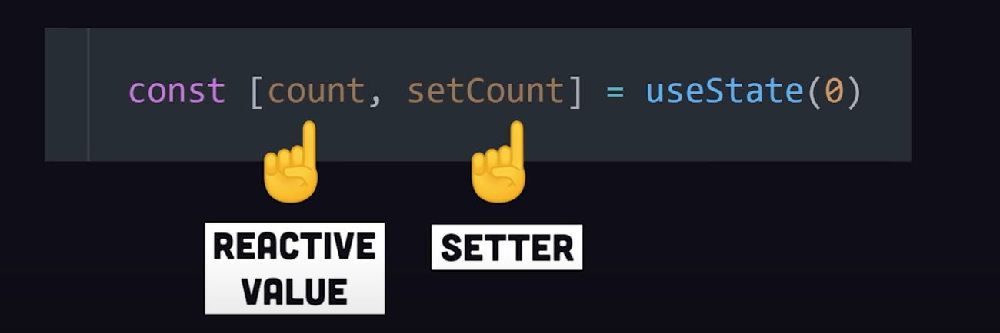

# React learning

## Built-in React Hooks:

> As of November 7, 2023, there are 15 built-in react hooks.
> Basic Hooks: useState, useEffect, useContext.

- State Hooks:
  - *State* let you "remember" information like input value or a selected image index. To add state to a componenet we can use one of these Hooks:
    - useState: declares a state variable that you can update directly.
    
    - useReducer: declares a state variable with the _update logic_ inside a reducer function.

### Useful Resources:
- 10 React Hooks Explained // Plus Build your own from Scratch (https://www.youtube.com/watch?v=TNhaISOUy6Q)
  - **Take Aways**:
    - Rules: Always call built-in hooks at the top level of a Functional Component as they do not work inside of a regular JavaScript function. Execpt when used with custom hooks.
